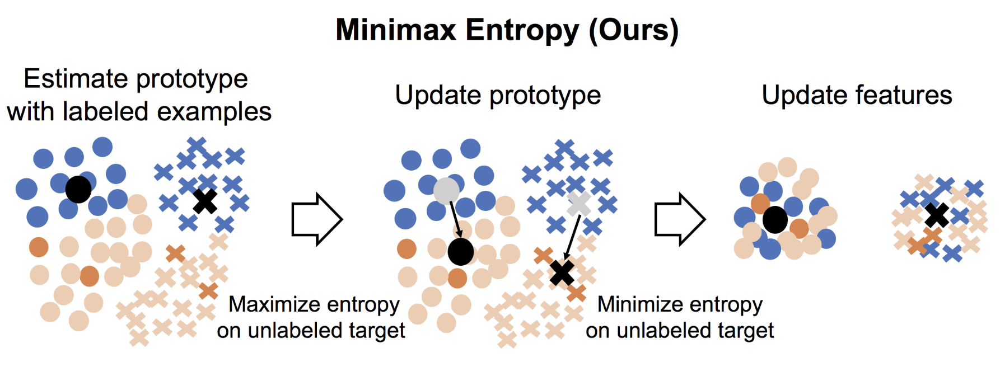

# [Semi-supervised Domain Adaptation via Minimax Entropy (ICCV 2019)](https://arxiv.org/pdf/1904.06487.pdf)



## Install

`pip install -r requirements.txt`

The code is written for Pytorch 0.4.0, but should work for other version
with some modifications.
## Data preparation (DomainNet)

To get data, run

`sh download_data.sh`

The images will be stored in the following way.

`./data/multi/real/category_name`,

`./data/multi/sketch/category_name`

The dataset split files are stored as follows,

`./data/txt/multi/labeled_source_images_real.txt`,

`./data/txt/multi/unlabeled_target_images_sketch_3.txt`,

`./data/txt/multi/validation_target_images_sketch_3.txt`.

At the moment (8/18/2019), we do not publish all data of DomainNet because we hold a [competition](http://ai.bu.edu/visda-2019/) and some domains are used there.

With regard to office and office home dataset, store the image files in the following ways,

 `./data/office/amazon/category_name`,
 `./data/office_home/Real/category_name`,

We provide the split of office and office-home.


## Training

To run training using alexnet,

`sh run_train.sh gpu_id method alexnet`

where, gpu_id = 0,1,2,3...., method=[MME,ENT,S+T].


### Reference
This repository is contributed by [Kuniaki Saito](http://cs-people.bu.edu/keisaito/) and [Donghyun Kim](https://cs-people.bu.edu/donhk/)
If you consider using this code or its derivatives, please consider citing:

```
@article{saito2019semi,
  title={Semi-supervised Domain Adaptation via Minimax Entropy},
  author={Saito, Kuniaki and Kim, Donghyun and Sclaroff, Stan and Darrell, Trevor and Saenko, Kate},
  journal={ICCV},
  year={2019}
}
```


